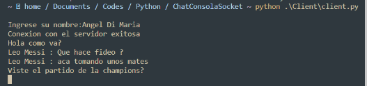

## Chat de consola usando Socket y TCP

la app utiliza las librerias socket y threading

para arrancar la app se inicia el servidor

```bash
 python .\Server\server.py
```

se pueden crear distintas instancias para los clientes, cada uno tendra un hilo dedicado

```bash
 python .\Client\client.py
```

ej server


ej cliente leo messi


ej cliente angel di maria


